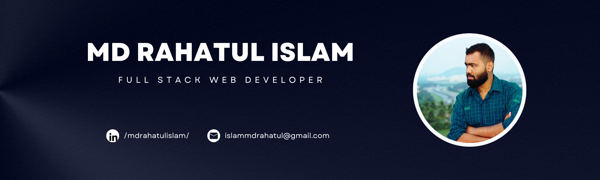

<!-- Profile README for Th3At0nic (Md Rahatul Islam) -->

  

  

<h1 align="center">I'm Rahat 👋</h1>
<h3 align="center">Full-Stack Web Developer | Tech Enthusiast</h3>

  <a href="https://my-fullstack-portfolio-frontend.vercel.app/" target="_blank">🌐 Portfolio</a> • 
  <a href="https://www.linkedin.com/in/mdrahatulislam/" target="_blank">💼 LinkedIn</a> • 
  <a href="mailto:islammdrahatul@gmail.com">📬 Email</a>

---

### 📊 GitHub Stats

  
   
  
   
  

---

### 📊 GitHub Achievement

---

### 🧠 About Me

I'm a full-stack web developer passionate about building reliable, scalable backend systems and intuitive frontends
Currently focusing on modern web technologies like **Next.js**, **Prisma**, and **PostgreSQL**.

- 🛠️ Specializing in **backend architecture**, RESTful APIs, and full-stack apps
- 💡 I love clean code, smart design patterns,and meaningful abstractions
- 🌱 Always learning, building, and solving problems with curiosity and care
- 🧰 Tech Stack: TypeScript, Node.js, Express, MongoDB, PostgreSQL, Prisma, React, Next.js

---

### 🛠 Tech Stack

---

### 🚀 Featured Projects

A few full-stack projects I’ve worked on recently:

- 🔧 **[CarNexa – Full-Stack Car Store](https://carstore-client.vercel.app/):** A complete car e-commerce app with authentication, admin dashboards, and product filtering.
- 🍔 **[Street Food Finder](https://street-bite-frontend.vercel.app/):** Discover, rate, and review local street food. Backend with REST APIs.
- 🗓️ **[Vibevent - Event Management Application](https://vibevent-frontend-event-management.vercel.app):** Full-stack event management system with custom auth, event CRUD, advanced filtering, and a responsive, modern UI. Powered by TypeScript, MERN stack & RTK Query.
- 💼 **[My Developer Portfolio](https://my-fullstack-portfolio-frontend.vercel.app/):** A clean, responsive showcase of my work and skillset.
- 🏏 **[BPL Team Selection](https://teamselection.netlify.app/):** A fun React app to create and manage your fantasy BPL team.
- 🏫 **University Management System:** Backend completed with robust structure; frontend in development.
- 🛵 **Bike Service Center App:** Backend ready, UI coming soon.

---

### 💬 Quote I Live By

> “The moment my work needs recognition to feel meaningful, it stops being worship.”

---

### 📬 Let's Connect

I'm open to freelance work, job opportunities, or just a good tech discussion

- 📧 [islammdrahatul@gmail.com](mailto:islammdrahatul@gmail.com)
- 🌐 [Portfolio (rahat.dev)](https://my-fullstack-portfolio-frontend.vercel.app/)
- 💼 [LinkedIn](https://www.linkedin.com/in/mdrahatulislam/)

---

  

  
    

  

